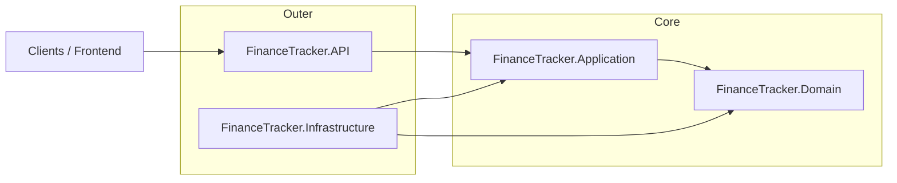

## 💰 FinanceTracker – Personal Finance API

> Opinionated .NET 8 Clean Architecture backend for tracking income, expenses, budgets, and real‑time alerts.

[](https://github.com/OWNER/REPO/actions/workflows/ci.yml)
[](#code-coverage)

### Tech Stack


---

## 🏗 Architecture

FinanceTracker follows Clean Architecture with CQRS and MediatR:



**Projects**

| Project                          | Description                                                                 |
|----------------------------------|-----------------------------------------------------------------------------|
| `FinanceTracker.Domain`          | Entities, value objects, domain events, core business rules.               |
| `FinanceTracker.Application`     | Use cases, CQRS (MediatR), validation, caching behavior, DTOs, contracts.  |
| `FinanceTracker.Infrastructure`  | EF Core, Dapper reports, Redis cache, MassTransit/RabbitMQ, repositories.  |
| `FinanceTracker.API`             | ASP.NET Core Web API, versioned controllers, SignalR, Serilog, middleware. |
| `FinanceTracker.UnitTests`       | Unit tests (xUnit, FluentAssertions, Moq).                                 |
| `FinanceTracker.IntegrationTests`| API + DB + bus integration tests, SpecFlow BDD scenarios.                  |
| `FinanceTracker.PerformanceTests`| NBomber performance/load scenarios for key endpoints.                       |

---

## ✨ Features

- **REST API** with versioning (`/api/v1/...`) and Swagger UI.
- **CQRS + MediatR** pipeline with validation and caching behaviors.
- **Clean Architecture** layering (Domain, Application, Infrastructure, API).
- **Redis caching** for query results with invalidation on writes.
- **RabbitMQ + MassTransit** for integration events (budget alerts, transactions).
- **SignalR** hub for real‑time budget/transaction notifications.
- **Dapper reporting** service for trends and spending insights.
- **Serilog** structured logging with correlation IDs and user enrichment.
- **BDD tests** with SpecFlow + xUnit.
- **Performance tests** with NBomber (transactions, summaries, mixed workloads).

---

## 🚀 Getting Started

### Prerequisites

- [.NET 8 SDK](https://dotnet.microsoft.com/download/dotnet/8.0)
- [Docker](https://www.docker.com/) + Docker Compose

### 1. Start infrastructure with Docker

From the repository root:

```bash
docker-compose up -d
```

This starts:

- **SQL Server** on `localhost:1433`
- **Redis** on `localhost:6379`
- **RabbitMQ** on `localhost:5672` with management UI on `http://localhost:15672` (guest/guest)

Make sure your `appsettings.json` connection strings match these endpoints.

### 2. Run the API

```bash
# Restore and build
dotnet restore
dotnet build

# Run API
dotnet run --project src/FinanceTracker.API/FinanceTracker.API.csproj
```

By default the API listens on `http://localhost:5000` (from `launchSettings.json`).

### 3. Swagger & Health

- **Swagger UI**: `http://localhost:5000/swagger`
- **Health check**: `http://localhost:5000/health`

---

## 📁 Project Structure

```text
FinanceTracker.sln
├─ src
│  ├─ FinanceTracker.Domain/           # Domain entities, value objects, events
│  ├─ FinanceTracker.Application/      # Commands, queries, behaviors, abstractions, DTOs
│  ├─ FinanceTracker.Infrastructure/   # EF Core, Dapper, Redis, MassTransit, repositories
│  └─ FinanceTracker.API/              # Controllers, middleware, SignalR, Program.cs
├─ tests
│  ├─ FinanceTracker.UnitTests/        # Unit tests for Domain & Application
│  ├─ FinanceTracker.IntegrationTests/ # WebApplicationFactory, HTTP + DB + bus tests, SpecFlow
│  └─ FinanceTracker.PerformanceTests/ # NBomber performance test console app
├─ docker-compose.yml                  # SQL Server, Redis, RabbitMQ for local dev
├─ run-coverage.sh / .ps1              # Coverage + ReportGenerator helpers
└─ .github/workflows/ci.yml            # CI, tests, coverage gating
```

---

## 🧪 Running Tests

From the repository root:

```bash
# All tests
dotnet test

# Unit tests
dotnet test tests/FinanceTracker.UnitTests/FinanceTracker.UnitTests.csproj

# Integration + BDD (SpecFlow) tests
dotnet test tests/FinanceTracker.IntegrationTests/FinanceTracker.IntegrationTests.csproj

# Performance tests (NBomber scenarios)
dotnet run --project tests/FinanceTracker.PerformanceTests/FinanceTracker.PerformanceTests.csproj
```

### Code Coverage

Coverage is collected using **Coverlet** and **ReportGenerator**.

```bash
# Linux/macOS
./run-coverage.sh

# Windows
./run-coverage.ps1
```

HTML report is generated under: `./coverage-report/index.html`.

Badge example (replace `OWNER` and `REPO`):

```markdown
[](./coverage-report/index.html)
```

---

## 🔗 API Endpoints (v1)

| Method | Path                                 | Description                               |
|--------|--------------------------------------|-------------------------------------------|
| POST   | `/api/v1/transactions`              | Create a transaction                      |
| GET    | `/api/v1/transactions`              | List transactions by `month`, `year`     |
| GET    | `/api/v1/transactions/summary`      | Monthly summary for `month`, `year`      |
| POST   | `/api/v1/budgets`                   | Set or update a budget                    |
| GET    | `/api/v1/budgets/status`            | Budget status for `month`, `year`        |
| GET    | `/api/v1/reports/trends`            | Monthly trend report (`months` param)     |
| GET    | `/api/v1/reports/insights`          | Spending insight for current user         |
| GET    | `/health`                           | Health checks (DB, Redis, RabbitMQ)      |
| GET    | `/hubs/budget` (SignalR)            | WebSocket endpoint for budget hub         |

All application endpoints are **JWT-protected** and require a valid Bearer token.

---

## 🧠 Design Decisions

### Why CQRS + MediatR?

- Separates **reads** (queries) from **writes** (commands), making business logic easier to reason about.
- Enables cross-cutting behaviors (validation, caching, logging) via **MediatR pipeline behaviors**.
- Improves testability: handlers are small, focused units that can be unit‑tested in isolation.

### Why Clean Architecture?

- Keeps the **domain model and use cases independent** of frameworks and infrastructure.
- Infrastructure (EF Core, Redis, RabbitMQ, Serilog) can evolve without rewriting core business logic.
- Encourages a strict dependency rule: outer layers depend on inner layers, never the reverse.

### Why Redis for caching?

- Finance data (transactions, summaries) is read much more often than it is written.
- Redis provides:
  - **Low‑latency** access for summary endpoints (e.g., monthly summaries).
  - Expiration policies and pattern‑based invalidation (e.g., `summary:{userId}:*` on new transactions).
- Using Redis behind a simple `ICacheService` abstraction keeps the Application layer clean and cache‑agnostic.

---

## 📜 License

MIT
